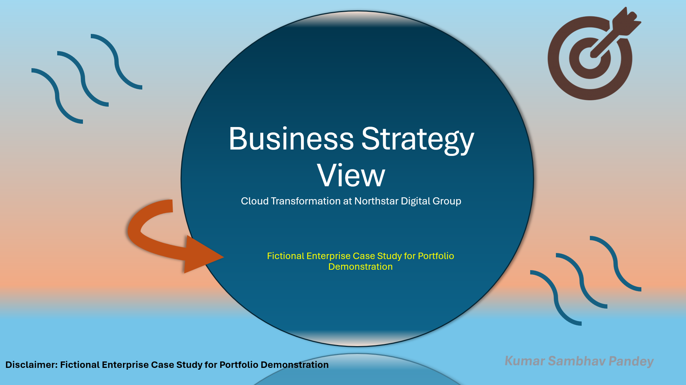
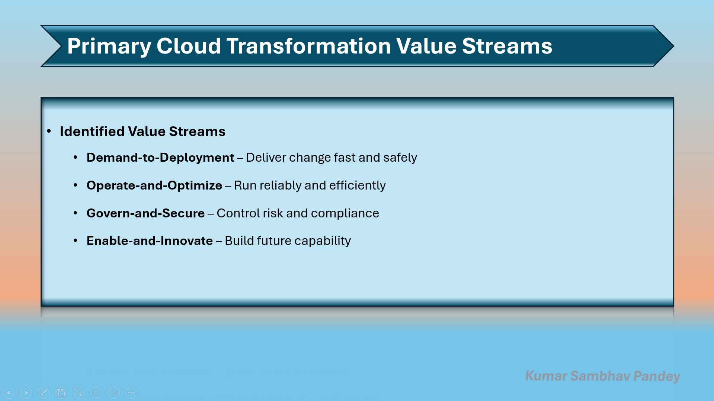
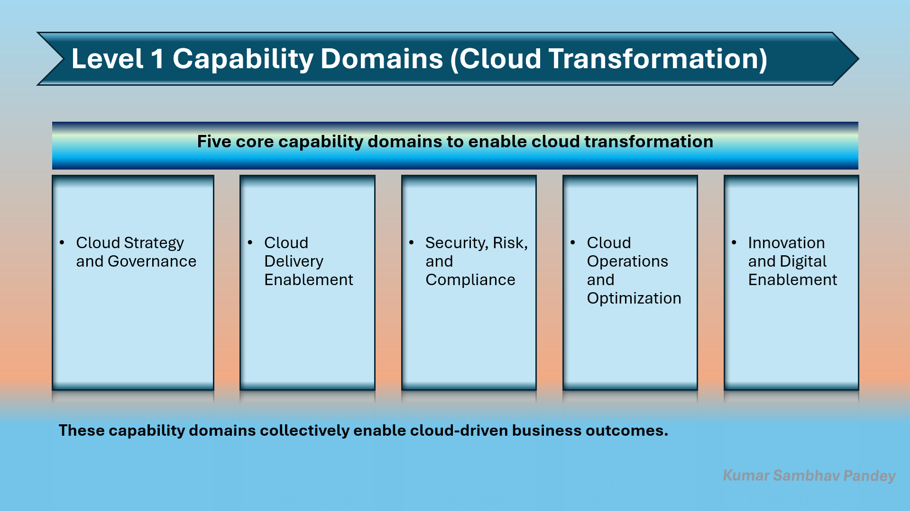
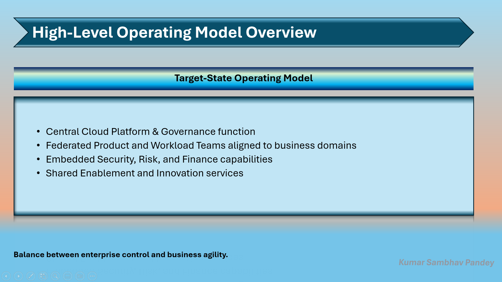
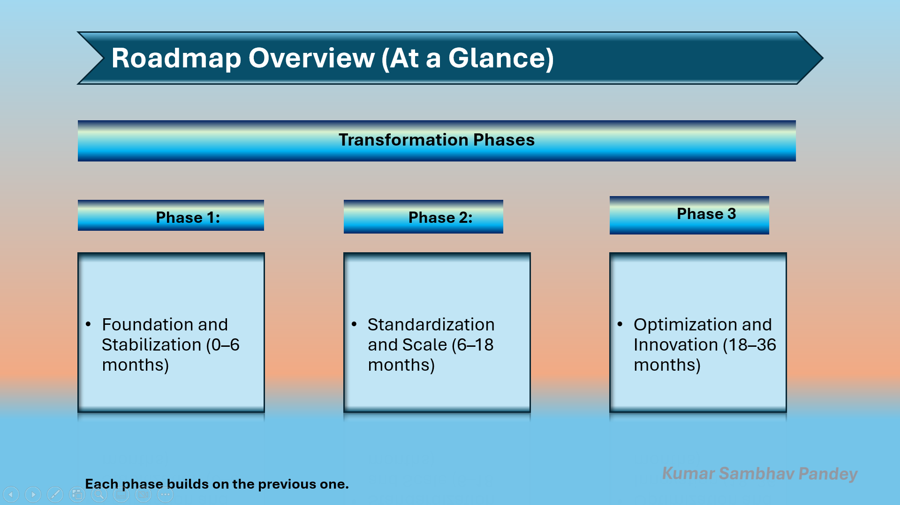
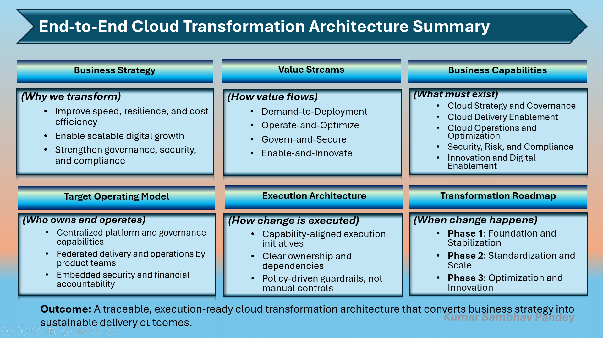

# Cloud Transformation Business Architecture  
## Northstar Digital Group (Fictional Enterprise Case Study)

---

## Overview

This case study presents a **fictional but realistic enterprise cloud transformation**
designed to demonstrate **business-led, execution-aware enterprise architecture thinking**.

The objective is not to showcase cloud tools or vendor services, but to illustrate how
**business strategy can be systematically translated into value streams, business capabilities,
operating models, execution initiatives, and a phased transformation roadmap**.

This structure mirrors how large enterprises plan and govern real transformation programs.

> **Disclaimer**  
> This is a fictional enterprise architecture case study created solely for learning,
> portfolio demonstration, and interview discussion purposes.  
> Any resemblance to real organizations is coincidental.

---

## Enterprise Context

Northstar Digital Group is a global manufacturing and distribution enterprise operating
across multiple regions with a predominantly legacy technology landscape.

The organization faces common enterprise challenges:
- Slow time-to-market for digital initiatives  
- Fragmented delivery and governance models  
- Rising infrastructure and operational costs  
- Limited scalability and resilience  
- Increasing security, compliance, and audit requirements  

Cloud transformation is initiated as a **business transformation enabler**, not a
technology refresh.

---

## Architecture Scope

This case study covers the full **business architecture to execution continuum**, including:

- Business strategy and transformation intent  
- Value stream identification  
- Business capability mapping  
- Target operating model design  
- Execution-oriented architecture views  
- Phased transformation roadmap  
- End-to-end architecture synthesis  

---

## Business Strategy View

The Business Strategy View establishes the **north-star objectives** and transformation
drivers guiding all downstream architecture decisions.



---

## Value Stream View

Value streams describe **how business value flows end-to-end**, independent of
organizational structure or technology choices.

The primary value streams identified are:
- Demand-to-Deployment  
- Operate-and-Optimize  
- Govern-and-Secure  
- Enable-and-Innovate  



---

## Business Capability Map

The Business Capability Map defines **what the enterprise must be able to do** to support
the identified value streams.

Capabilities are:
- Business-owned  
- Stable over time  
- Technology-agnostic  

This ensures architectural longevity and clarity.



---

## Target Operating Model

The Target Operating Model defines **how the enterprise is structured to govern, deliver,
and operate cloud-enabled capabilities**.

Key design principles include:
- Centralized platform, security, and governance capabilities  
- Federated product and workload delivery teams  
- Embedded security and financial accountability by design  



---

## Execution Architecture

Execution architecture bridges business architecture and delivery by translating
capabilities into **initiative-level execution structures**.

Execution artefacts include:
- Execution architecture overview  
- Execution views per value stream  
- Governance and control mechanisms  

These artefacts demonstrate how transformation intent becomes **delivery-ready**.

---

## Transformation Roadmap

The transformation roadmap sequences execution initiatives across three phases:

- **Phase 1: Foundation and Stabilization**  
- **Phase 2: Standardization and Scale**  
- **Phase 3: Optimization and Innovation**

The roadmap emphasizes sequencing discipline rather than rigid timelines.



---

## End-to-End Architecture Summary

The End-to-End Architecture Summary consolidates **strategy, value streams, capabilities,
operating model, execution, and roadmap** into a single executive-level view.

This artefact is intended for:
- Executive walkthroughs  
- Interview discussions  
- Rapid architectural orientation  



---

## Traceability Artifacts

To demonstrate architectural rigor without over-engineering, lightweight traceability
artefacts are included:

- **Strategy → Value Stream Mapping**  
  `artifacts/strategy-to-value-stream.xlsx`

- **Value Stream → Business Capability Mapping**  
  `artifacts/value-stream-to-capability.xlsx`

These artefacts ensure **clear alignment from business intent to execution structure**
while remaining readable and decision-focused.

---

## Repository Structure (Key Sections)

```text
cloud-transformation-business-architecture/
│
├── screenshots/                  ← Executive visuals for GitHub
├── decks/                        ← Architecture narrative decks
├── execution-architecture/       ← Execution-level architecture views
├── deep-dives/                   ← Written decision rationale
├── artifacts/                    ← Traceability and supporting models
└── README.md
